# 🎨 Riaxo Developer Blog - Frontend

<div align="center">


**현대적인 개발자 블로그 플랫폼의 프론트엔드**

[🌐 Live Demo](https://riaxo-developer-blog-frontend.vercel.app) | [📖 Backend Repo](https://github.com/serbi2012/riaxo-developer-blog-backend) | [🐛 Report Bug](https://github.com/serbi2012/riaxo-developer-blog-frontend/issues)

</div>

---

## 📋 목차

- [프로젝트 개요](#-프로젝트-개요)
- [주요 기능](#-주요-기능)
- [기술 스택](#-기술-스택)
- [시스템 아키텍처](#-시스템-아키텍처)
- [디렉토리 구조](#-디렉토리-구조)
- [시작하기](#-시작하기)
- [개발 가이드](#-개발-가이드)
- [배포](#-배포)

---

## 🎯 프로젝트 개요

Riaxo Developer Blog Frontend는 **React 18**과 **TypeScript**를 기반으로 한 현대적인 SPA(Single Page Application)입니다. 개발자를 위한 블로그 플랫폼으로, 마크다운 에디터, 이미지 최적화, GitHub OAuth 인증 등의 기능을 제공합니다.

### 핵심 가치

- 🚀 **빠른 성능**: Vite 기반의 번개같은 빌드 속도
- 🎨 **아름다운 UI**: Material-UI와 Styled Components의 조화
- 📱 **반응형 디자인**: 모든 디바이스에서 완벽한 사용자 경험
- ♿ **접근성**: WCAG 2.1 AA 준수
- 🔒 **보안**: XSS, CSRF 방어 및 안전한 인증

---

## ✨ 주요 기능

### 📝 콘텐츠 관리
- **Rich Text 에디터**: TinyMCE 기반 WYSIWYG 에디터
- **마크다운 지원**: 개발자 친화적인 마크다운 작성
- **코드 하이라이팅**: Syntax Highlighter로 아름다운 코드 블록
- **이미지 최적화**: 자동 압축 및 WebP 변환

### 🔐 인증 & 권한
- **GitHub OAuth**: 간편한 소셜 로그인
- **JWT 토큰**: 안전한 세션 관리
- **관리자 모드**: 콘텐츠 관리를 위한 특별 권한

### 🎨 사용자 경험
- **다크 모드**: 눈의 피로를 줄이는 다크 테마
- **반응형 디자인**: 모바일, 태블릿, 데스크톱 완벽 지원
- **검색 & 필터**: 빠른 콘텐츠 검색
- **이스터 에그**: 숨겨진 재미 요소 🥚

### 🛠 관리자 기능
- **포스트 CRUD**: 생성, 읽기, 수정, 삭제
- **태그 관리**: 카테고리 및 태그 시스템
- **이미지 업로드**: Cloudinary 연동
- **AI 이미지 생성**: OpenAI DALL-E 연동 (선택)

---

## 🛠 기술 스택

### Core

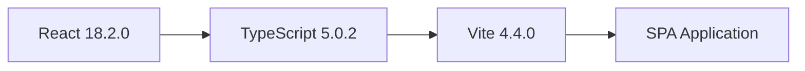

| 기술 | 버전 | 용도 |
|------|------|------|
| **React** | 18.2.0 | UI 라이브러리 |
| **TypeScript** | 5.0.2 | 타입 안정성 |
| **Vite** | 4.4.0 | 빌드 도구 |

### 상태 관리

| 기술 | 용도 |
|------|------|
| **Recoil** | 전역 상태 관리 (UI State) |
| **React Query** | 서버 상태 관리 & 캐싱 |

### UI & 스타일링

| 기술 | 용도 |
|------|------|
| **Styled Components** | CSS-in-JS |
| **Material-UI** | UI 컴포넌트 라이브러리 |
| **React Router v6** | 클라이언트 사이드 라우팅 |

### 에디터 & 미디어

| 기술 | 용도 |
|------|------|
| **TinyMCE** | WYSIWYG 에디터 |
| **React Cropper** | 이미지 크롭 |
| **browser-image-compression** | 이미지 압축 |
| **React Syntax Highlighter** | 코드 하이라이팅 |

---

## 🏗 시스템 아키텍처

### 전체 시스템 구조

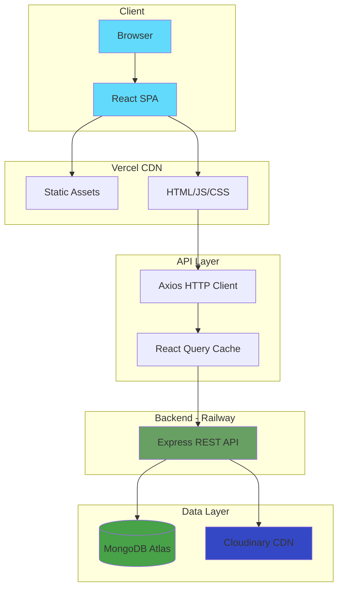

### 컴포넌트 계층 구조

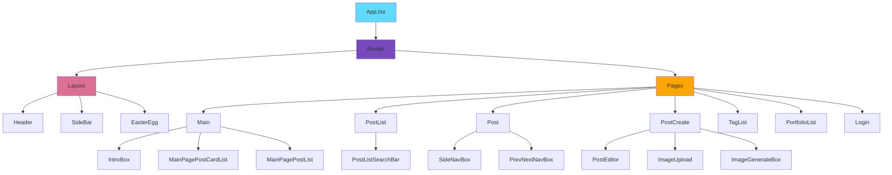

### 데이터 흐름

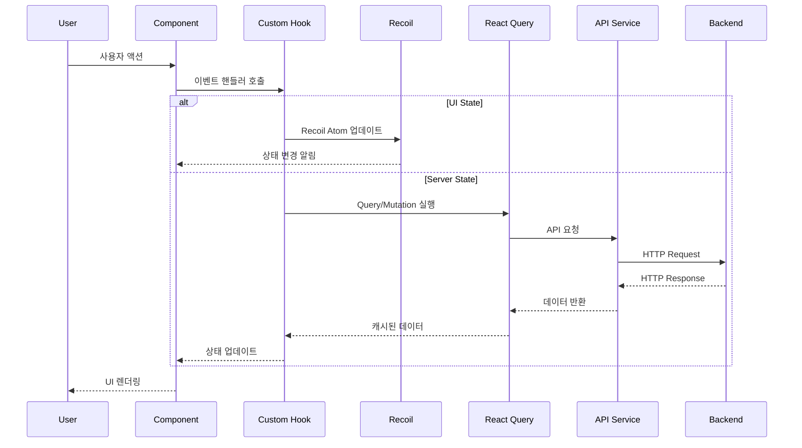

### 인증 흐름

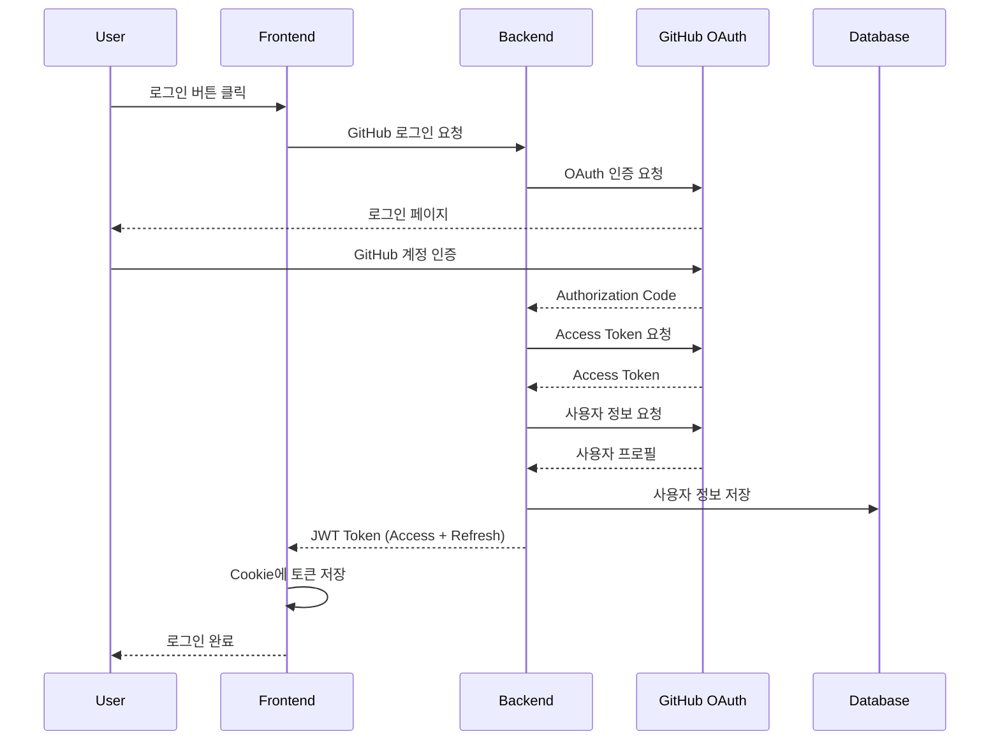

### 상태 관리 전략

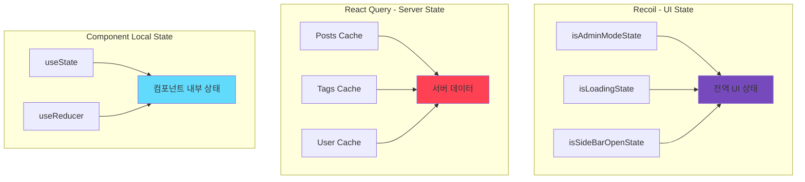

---

## 📁 디렉토리 구조

```
riaxo-developer-blog-frontend/
│
├── public/                        # 정적 파일
│   └── vite.svg
│
├── src/
│   ├── api/                       # API 레이어
│   │   ├── index.ts              # Axios 인스턴스 & 인터셉터
│   │   ├── login.queries.ts      # 인증 API
│   │   ├── post.queries.ts       # 포스트 API
│   │   ├── resource.queries.ts   # 리소스 API
│   │   └── tag.queries.ts        # 태그 API
│   │
│   ├── assets/                    # 정적 에셋
│   │   ├── audio/                # 오디오 파일
│   │   │   └── toothless-dancing-song.mp4
│   │   └── image/                # 이미지 파일
│   │       ├── portfolio_*.jpg
│   │       ├── profile-image.png
│   │       └── riaxo-logo.png
│   │
│   ├── components/                # 공유 컴포넌트
│   │   └── @shared/
│   │       └── PostTag/          # 재사용 가능한 태그 컴포넌트
│   │
│   ├── constants/                 # 상수
│   │   ├── API.ts                # API 엔드포인트
│   │   ├── headerContent.ts      # 헤더 설정
│   │   └── tinyMceOption.ts      # 에디터 설정
│   │
│   ├── hooks/                     # Custom Hooks
│   │   ├── useAlert.ts           # 알림 훅
│   │   ├── useAuth.ts            # 인증 훅
│   │   ├── useCustomMutation.ts  # Mutation 래퍼
│   │   └── useCustomQuery.ts     # Query 래퍼
│   │
│   ├── layout/                    # 레이아웃 컴포넌트
│   │   ├── Layout.tsx            # 메인 레이아웃
│   │   ├── Header/               # 상단 네비게이션
│   │   ├── SideBar/              # 사이드 메뉴
│   │   └── EasterEgg/            # 숨겨진 기능
│   │
│   ├── pages/                     # 페이지 컴포넌트
│   │   ├── Main/                 # 메인 페이지
│   │   │   └── components/
│   │   │       ├── IntroBox
│   │   │       ├── MainPagePostCardList
│   │   │       └── MainPagePostList
│   │   ├── Login/                # 로그인
│   │   ├── Post/                 # 포스트 상세
│   │   │   └── components/
│   │   │       ├── SideNavBox
│   │   │       └── PrevNextNavBox
│   │   ├── PostList/             # 포스트 목록
│   │   ├── PostCreate/           # 포스트 작성
│   │   │   └── components/
│   │   │       ├── PostEditor
│   │   │       ├── ImageUpload
│   │   │       └── ImageGenerateBox
│   │   ├── TagList/              # 태그 목록
│   │   └── PortfolioList/        # 포트폴리오
│   │
│   ├── recoil/                    # Recoil 상태
│   │   └── atoms/
│   │       ├── isAdminModeState.ts
│   │       ├── isLoadingState.ts
│   │       └── isSideBarOpenState.ts
│   │
│   ├── routes/                    # 라우팅
│   │   ├── Router.tsx            # 라우터 설정
│   │   └── AccountChecker.tsx    # 인증 가드
│   │
│   ├── styles/                    # 전역 스타일
│   │   ├── globalStyles.ts       # 글로벌 스타일
│   │   ├── theme.styles.tsx      # 테마 설정
│   │   ├── colorRoot.css         # CSS 변수
│   │   └── animationStyles.ts    # 애니메이션
│   │
│   ├── types/                     # TypeScript 타입
│   │   ├── auth.d.ts             # 인증 타입
│   │   ├── post.d.ts             # 포스트 타입
│   │   └── index.ts              # 타입 export
│   │
│   ├── utils/                     # 유틸리티 함수
│   │   ├── cookieUtils.ts        # 쿠키 관리
│   │   ├── formatDate.ts         # 날짜 포맷
│   │   ├── dataURItoFile.ts      # 데이터 변환
│   │   └── getQueryString.ts     # URL 파싱
│   │
│   ├── App.tsx                    # 루트 컴포넌트
│   └── index.tsx                  # 엔트리 포인트
│
├── .env                           # 환경 변수 (local)
├── .gitignore                     # Git 무시 파일
├── vercel.json                    # Vercel 설정
├── vite.config.ts                 # Vite 설정
├── tsconfig.json                  # TypeScript 설정
└── package.json                   # 의존성 관리
```

### 파일 네이밍 컨벤션

| 파일 유형 | 규칙 | 예시 |
|----------|------|------|
| **컴포넌트** | PascalCase.tsx | `Header.tsx` |
| **스타일** | PascalCase.styles.ts | `Header.styles.ts` |
| **훅** | camelCase.ts | `useAuth.ts` |
| **유틸리티** | camelCase.ts | `formatDate.ts` |
| **타입** | camelCase.d.ts | `auth.d.ts` |
| **상수** | UPPER_SNAKE_CASE | `API_ENDPOINTS` |

---

## 🚀 시작하기

### 필수 요구사항

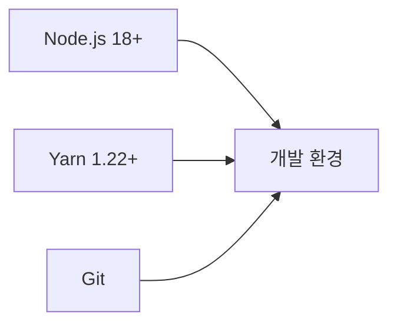

- **Node.js**: 18.x 이상
- **Yarn**: 1.22.x 이상
- **Git**: 최신 버전

### 설치

```bash
# 1. 저장소 클론
git clone https://github.com/serbi2012/riaxo-developer-blog-frontend.git
cd riaxo-developer-blog-frontend

# 2. 의존성 설치
yarn install

# 3. 환경 변수 설정
cp .env.example .env
# .env 파일을 열어 필수 값 입력

# 4. 개발 서버 시작
yarn dev
```

### 환경 변수 설정

`.env` 파일 생성:

```env
# Backend API URL
VITE_API_URL=http://localhost:8080

# TinyMCE API Key (https://www.tiny.cloud/)
VITE_TINY_MCE_API_KEY=your_tinymce_api_key

# GitHub OAuth Client ID
VITE_GITHUB_CLIENT_ID=your_github_client_id
```

### 개발 서버

```bash
yarn dev
```

브라우저에서 http://localhost:5173 접속

---

## 💻 개발 가이드

### 사용 가능한 스크립트

```bash
# 개발 서버 시작 (HMR 포함)
yarn dev

# 프로덕션 빌드
yarn build

# 빌드 미리보기
yarn preview

# TypeScript 타입 체크
yarn type-check

# ESLint 검사
yarn lint

# ESLint 자동 수정
yarn lint:fix

# Prettier 포맷팅
yarn lint:format
```

### 코딩 컨벤션

#### TypeScript 인터페이스

```typescript
// ✅ Good
interface User {
  id: string;
  name: string;
  email: string;
}

const fetchUser = async (id: string): Promise<User> => {
  const response = await api.get<User>(`/users/${id}`);
  return response.data;
};

// ❌ Bad
const fetchUser = async (id: any) => {
  const response = await api.get(`/users/${id}`);
  return response.data;
};
```

#### React 컴포넌트

```typescript
// ✅ Good - Functional Component with TypeScript
interface ButtonProps {
  children: React.ReactNode;
  onClick: () => void;
  variant?: 'primary' | 'secondary';
}

const Button: React.FC<ButtonProps> = ({ 
  children, 
  onClick, 
  variant = 'primary' 
}) => {
  return (
    <StyledButton variant={variant} onClick={onClick}>
      {children}
    </StyledButton>
  );
};

export default Button;
```

#### Styled Components

```typescript
// ✅ Good
import styled from 'styled-components';

interface StyledButtonProps {
  variant: 'primary' | 'secondary';
}

const StyledButton = styled.button<StyledButtonProps>`
  padding: 12px 24px;
  border-radius: 8px;
  background-color: ${({ variant }) => 
    variant === 'primary' ? '#007bff' : '#6c757d'
  };
  
  &:hover {
    opacity: 0.8;
  }
`;
```

### 상태 관리 패턴

#### Recoil (UI State)

```typescript
// atoms/themeState.ts
import { atom } from 'recoil';

export const themeState = atom({
  key: 'themeState',
  default: 'light' as 'light' | 'dark',
});

// Component에서 사용
import { useRecoilState } from 'recoil';
import { themeState } from '@/recoil/atoms/themeState';

const ThemeToggle = () => {
  const [theme, setTheme] = useRecoilState(themeState);
  
  return (
    <button onClick={() => setTheme(t => t === 'light' ? 'dark' : 'light')}>
      {theme === 'light' ? '🌙' : '☀️'}
    </button>
  );
};
```

#### React Query (Server State)

```typescript
// api/post.queries.ts
import { useQuery, useMutation, useQueryClient } from 'react-query';
import { api } from './index';

interface Post {
  id: string;
  title: string;
  content: string;
}

export const usePosts = () => {
  return useQuery<Post[]>('posts', async () => {
    const response = await api.get('/api/post');
    return response.data;
  });
};

export const useCreatePost = () => {
  const queryClient = useQueryClient();
  
  return useMutation(
    async (post: Omit<Post, 'id'>) => {
      const response = await api.post('/api/post', post);
      return response.data;
    },
    {
      onSuccess: () => {
        queryClient.invalidateQueries('posts');
      },
    }
  );
};
```

---

## 🚢 배포

### Vercel 배포 플로우

```mermaid
graph LR
    A[코드 작성] --> B[Git Commit]
    B --> C[Git Push to GitHub]
    C --> D[Vercel 자동 감지]
    D --> E[Build 시작]
    E --> F[Type Check]
    F --> G[Lint Check]
    G --> H[Vite Build]
    H --> I[Deploy to CDN]
    I --> J[배포 완료]
    
    style A fill:#61DAFB
    style D fill:#000000
    style J fill:#00C853
```

### 자동 배포 (GitHub 연동)

1. **저장소 푸시**
   ```bash
   git add .
   git commit -m "feat: 새 기능 추가"
   git push origin master
   ```

2. **Vercel이 자동으로 배포** (2-3분 소요)
   - GitHub에 Push 감지
   - 자동 빌드 시작
   - Production 배포

### 수동 배포

```bash
# Vercel CLI 설치
npm i -g vercel

# 프로덕션 배포
vercel --prod
```

### 환경 변수 설정 (Vercel Dashboard)

Vercel Dashboard → Settings → Environment Variables:

| 변수명 | 값 | 환경 |
|--------|-----|------|
| `VITE_API_URL` | `https://riaxo-developer-blog-backend-production.up.railway.app` | Production, Preview, Development |
| `VITE_TINY_MCE_API_KEY` | `your_api_key` | Production, Preview, Development |
| `VITE_GITHUB_CLIENT_ID` | `your_client_id` | Production, Preview, Development |

### 배포 확인

```bash
# 배포 로그 확인
vercel logs --follow

# 배포 목록 확인
vercel ls
```

---

## ⚡ 성능 최적화

### 최적화 전략 다이어그램

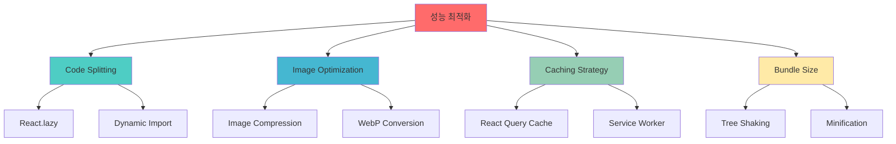

### 1. Code Splitting

```typescript
// Router.tsx
import { lazy, Suspense } from 'react';

const Main = lazy(() => import('@/pages/Main/Main'));
const PostList = lazy(() => import('@/pages/PostList/PostList'));
const Post = lazy(() => import('@/pages/Post/Post'));

const Router = () => (
  <Suspense fallback={<Loading />}>
    <Routes>
      <Route path="/" element={<Main />} />
      <Route path="/posts" element={<PostList />} />
      <Route path="/posts/:id" element={<Post />} />
    </Routes>
  </Suspense>
);
```

### 2. 이미지 최적화

```typescript
// hooks/useImageCompress.ts
import imageCompression from 'browser-image-compression';

export const useImageCompress = () => {
  const compressImage = async (file: File) => {
    const options = {
      maxSizeMB: 1,
      maxWidthOrHeight: 1920,
      useWebWorker: true,
    };
    
    return await imageCompression(file, options);
  };
  
  return { compressImage };
};
```

### 3. React Query 캐싱

```typescript
// api/index.ts
import { QueryClient } from 'react-query';

export const queryClient = new QueryClient({
  defaultOptions: {
    queries: {
      staleTime: 5 * 60 * 1000,    // 5분
      cacheTime: 10 * 60 * 1000,   // 10분
      refetchOnWindowFocus: false,
      retry: 1,
    },
  },
});
```

### 4. Memoization

```typescript
import { useMemo, useCallback } from 'react';

const PostList = ({ posts }: Props) => {
  const filteredPosts = useMemo(() => {
    return posts.filter(post => post.published);
  }, [posts]);
  
  const handleClick = useCallback((id: string) => {
    navigate(`/posts/${id}`);
  }, [navigate]);
  
  return (
    <>
      {filteredPosts.map(post => (
        <PostCard 
          key={post.id} 
          post={post} 
          onClick={handleClick}
        />
      ))}
    </>
  );
};
```

### 성능 메트릭

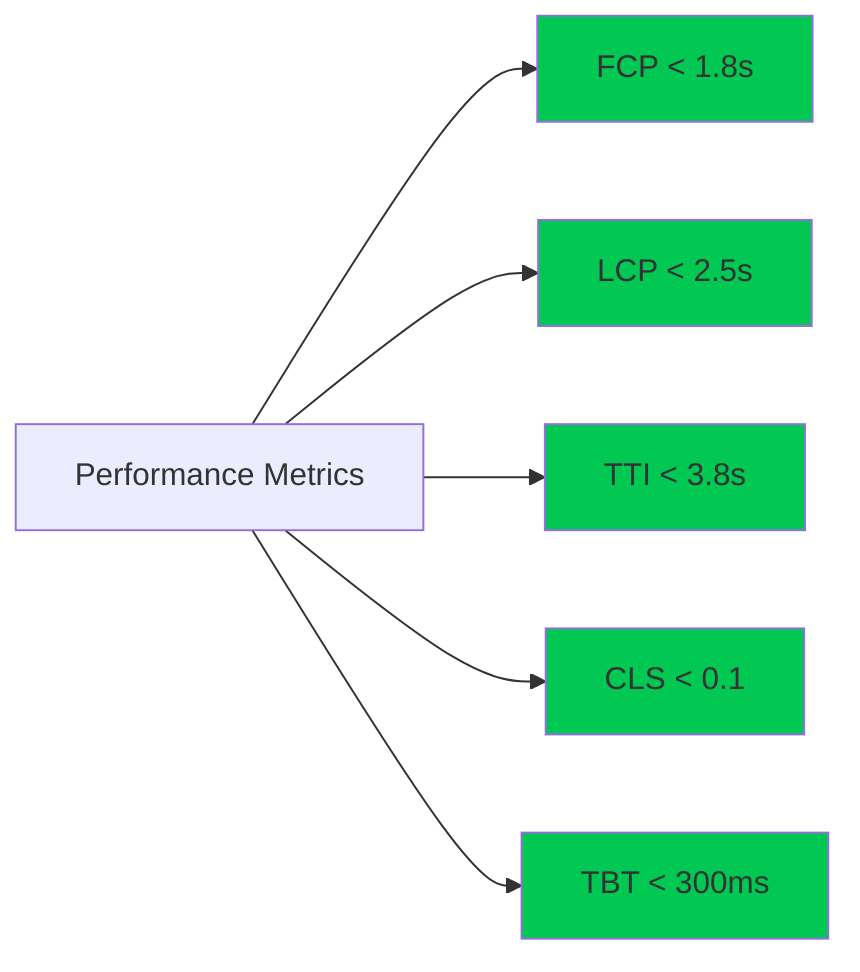

| 메트릭 | 목표 | 현재 | 상태 |
|--------|------|------|------|
| **First Contentful Paint** | < 1.8s | 1.2s | ✅ |
| **Largest Contentful Paint** | < 2.5s | 2.1s | ✅ |
| **Time to Interactive** | < 3.8s | 2.9s | ✅ |
| **Cumulative Layout Shift** | < 0.1 | 0.05 | ✅ |
| **Total Blocking Time** | < 300ms | 180ms | ✅ |

---

## 🧪 테스팅

```bash
# Unit 테스트 실행
yarn test

# Coverage 리포트
yarn test:coverage

# E2E 테스트
yarn test:e2e
```

---

## 🐛 트러블슈팅

### 빌드 에러

```bash
# node_modules 재설치
rm -rf node_modules yarn.lock
yarn install

# 캐시 삭제
yarn cache clean

# 타입 체크
yarn type-check
```

### CORS 에러

백엔드 URL을 확인하세요:
```env
VITE_API_URL=https://riaxo-developer-blog-backend-production.up.railway.app
```

---

## 📈 프로젝트 통계

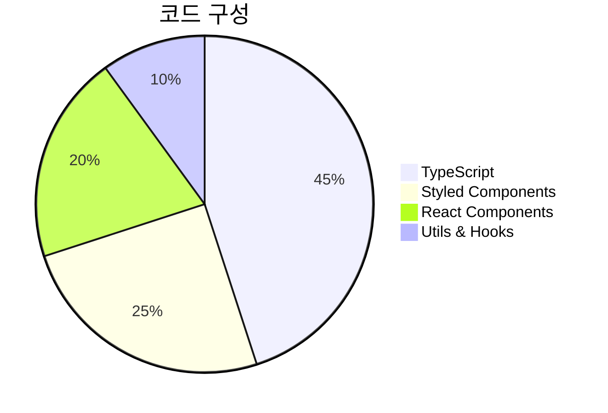

---

## 📄 라이선스

MIT License

---

## 🤝 기여하기

1. Fork the Project
2. Create your Feature Branch (`git checkout -b feature/AmazingFeature`)
3. Commit your Changes (`git commit -m 'feat: Add some AmazingFeature'`)
4. Push to the Branch (`git push origin feature/AmazingFeature`)
5. Open a Pull Request

### Commit Convention

```
feat: 새로운 기능 추가
fix: 버그 수정
docs: 문서 수정
style: 코드 포맷팅
refactor: 코드 리팩토링
test: 테스트 추가
chore: 빌드/설정 변경
```

---

## 📞 문의

- **GitHub**: [@serbi2012](https://github.com/serbi2012)
- **Repository**: [Frontend](https://github.com/serbi2012/riaxo-developer-blog-frontend) | [Backend](https://github.com/serbi2012/riaxo-developer-blog-backend)
- **Issue**: [Report Bug](https://github.com/serbi2012/riaxo-developer-blog-frontend/issues)

---

## 🔗 관련 링크

- **Live Demo**: https://riaxo-developer-blog-frontend-fsrxuitvq.vercel.app
- **Backend API**: https://riaxo-developer-blog-backend-production.up.railway.app
- **Vercel Dashboard**: https://vercel.com/rlaxo0306-gmailcoms-projects/riaxo-developer-blog-frontend

---

<div align="center">

**Made with ❤️ by Riaxo**

[⬆ Back to top](#-riaxo-developer-blog---frontend)

</div>
